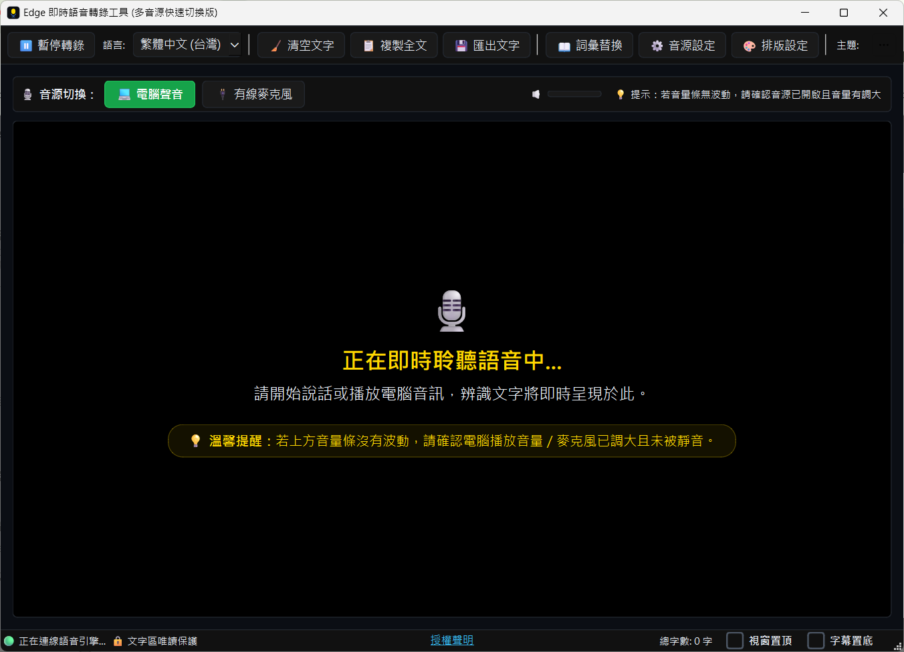

# Edge 即時語音轉錄桌面工具（多音源快速切換版）

專為聽障、聽損人士及多音源轉錄需求（線上會議、課程、市話錄音、現場授課）設計的本機桌面應用。在背景靜默啟動 Microsoft Edge，透過其高精度 Web Speech API 雲端模型，實現毫秒級語音轉文字與多音源一鍵無縫切流。



## 📥 下載

免安裝 Python 環境，直接下載打包好的單檔執行檔（Windows）：

**[⬇️ 下載 EdgeSRT-Desktop.exe](https://u.pcloud.link/publink/show?code=XZFUF5JZPIKoY1gwCFX2PD4F8BPX0FkQQdEy)**

---

## 🌟 核心特性

1. **多音源一鍵快速切換**：
   - 自動掃描 Windows 系統偵測到的所有音訊輸入端點（如立體聲混音、Line In、USB 麥克風等）。
   - 依裝置名稱智慧預設別名（名稱含「USB」→ 🎤 USB麥克風；「線路輸入 / Line In」→ 🔌 有線麥克風；立體聲混音類 → 💻 電腦聲音；其餘依關鍵字判斷），使用者可自行覆寫並永久記憶。
   - 主視窗頂部常駐快捷按鈕，點擊一鍵切換系統預設錄音源並立即重連辨識。

2. **Edge 背景靜默辨識引擎**：
   - Edge 瀏覽器以獨立 profile 在背景隱藏運行，利用 Web Speech API 進行高精度免費轉錄。
   - 內建**斷線自動重連**、**音量心跳卡死自動恢復**、**孤兒進程自動清理**（啟動前偵測並清除上次未正常關閉殘留的背景進程）。
   - 啟動前自動清除可安全重建的 Edge 快取（GPU shader、遙測記錄等），避免 profile 長期使用持續肥大；語音辨識所需元件不受影響。
   - 毫秒級 WebSocket 雙向資料流推送，僅影響本工具自建的 Edge 進程，不影響使用者平常在用的瀏覽器。

3. **全功能字幕筆記編輯區**：
   - 支援即時臨時字預覽（Interim）與最終落地字（Final），並自動過濾語音引擎重連造成的重複落地段落。
   - 自訂字級大小（12～100pt）、行距倍數、字型選擇。
   - 7 種主題可切換：🌙 夜晚（預設）、☀️ 白天、📜 羊皮、🌊 深海、🌿 森林、🍵 禪風，以及可自訂配色的 🎨 自訂主題。
   - 【視窗置頂】常駐最上層、【字幕置底】強制捲動、懸浮【⬇️ 回到底部】按鈕、版面配置切換（全螢幕 / 1/2 / 1/3）。
   - 錄音中文字區唯讀保護，暫停轉錄後開放自由編輯。

4. **輔助工具**：
   - **📖 詞彙替換表**：自訂常見錯別字、專業術語自動修正字典。
   - **💾 匯出文字**：一鍵匯出 TXT 文字檔，或複製全文到剪貼簿。
   - **⚡ 自動存檔**：每 10 秒自動存檔，程式異常結束後重啟可還原上次未儲存的內容。
   - **授權聲明**：作者資訊、意見回饋聯絡信箱、第三方套件清單。

---

## 🚀 快速啟動

### 開發模式

1. 確保電腦已安裝 Python 3.10+ 及 Microsoft Edge。
2. 安裝依賴：
   ```bash
   pip install -r requirements.txt
   ```
3. 執行程式：
   - 雙擊 `run.bat`，或在終端機執行：
   ```bash
   python main.py
   ```

### 打包成單檔執行檔

```bash
build.bat
```

編譯完成的 `EdgeSRT-Desktop.exe` 會輸出到 `dist\` 資料夾（此路徑已被 `.gitignore` 排除，不會進版控）。

---

## 📂 專案結構

```
edgesrt-desktop\
├── bin\                     # 音訊端點快速切換工具（NirSoft SoundVolumeView，第三方，附完整授權套件）
│   ├── SoundVolumeView.exe
│   ├── SoundVolumeView.chm
│   └── readme.txt
├── capturer\
│   └── index.html          # Web Speech API 辨識引擎與 WebSocket 通訊頁
├── ui\
│   ├── main_window.py      # PyQt6 桌面主視窗與互動邏輯
│   ├── settings_dialog.py  # 音源裝置管理與別名設定面板
│   ├── glossary_dialog.py  # 詞彙替換表管理
│   ├── typography_dialog.py # 字體/行距/主題排版設定
│   ├── license_dialog.py   # 授權聲明對話框
│   ├── theme.py             # 主題與配色定義
│   └── assets\              # 圖示等靜態資源
├── audio_manager.py         # Windows Core Audio 裝置偵測與切換邏輯
├── capture_server.py        # 本機 HTTP + WebSocket 服務端，管理背景 Edge 進程
├── main.py                  # 程式入口
├── build.bat                # PyInstaller 單檔打包腳本
└── run.bat                  # Windows 開發模式一鍵啟動腳本
```

執行時期會在本機自動建立 `_appdata\`（設定檔、自動存檔、日誌、Edge profile），此目錄不進版控。

---

## 系統需求

- Windows 10 / 11
- Python 3.10+（僅開發模式需要；打包後的 exe 不需要）
- Microsoft Edge（提供語音辨識引擎）

---

## 授權聲明

本程式由徐承佑獨立開發與維護，如有使用意見歡迎回饋 **[llm0968@gmail.com](mailto:llm0968@gmail.com)**。

本程式專為聾人、聽障朋友及多音源即時轉錄輔助需求開發，秉持**公益無償、輔助溝通**之初衷提供使用，全無商業營利行為。

### 使用之第三方套件與技術

| 套件 / 工具 | 用途 | 授權 |
|---|---|---|
| [PyQt6](https://www.riverbankcomputing.com/software/pyqt/)（Riverbank Computing） | 高效能 GUI 桌面框架 | GPL v3 |
| [PyQt6-Qt6](https://www.qt.io/)（PyQt6 依賴，內含 Qt6 核心函式庫） | 底層 UI 渲染引擎 | LGPL v3 |
| [PyQt6-sip](https://github.com/Python-SIP/sip) | PyQt6 的 Python/C++ 綁定橋接層 | BSD-2-Clause |
| [aiohttp](https://github.com/aio-libs/aiohttp) | 非同步 HTTP 與 WebSocket 串流伺服端 | Apache 2.0 |
| [comtypes](https://github.com/enthought/comtypes) | Windows Core Audio API 底層端點列舉 | MIT License |
| [pywin32](https://github.com/mhammond/pywin32) | Windows 系統整合與 Win32 API 調用 | PSF License |
| [SoundVolumeView](https://www.nirsoft.net/utils/sound_volume_view.html)（NirSoft） | Windows 預設錄音端點快速切換工具 | Freeware＊ |
| [PyInstaller](https://pyinstaller.org/) | 打包為單檔執行檔，其 bootloader 會嵌入編譯後的 exe | GPL v2（附帶授權例外條款，允許以任意授權散布編譯後的應用程式） |
| Web Speech API | Microsoft Edge / Chromium 即時語音辨識雲端引擎 | 微軟專有服務，非套件 |

*註：第三方開源專案作者未參與本程式開發，亦不代表其背書。相關商標與技術歸各原作者所有。*

**＊ SoundVolumeView 原始授權條款**（節錄自 [NirSoft 官方頁面](https://www.nirsoft.net/utils/sound_volume_view.html)）：「You are allowed to freely distribute this utility via floppy disk, CD-ROM, Internet, or in any other way, as long as you don't charge anything for this and you don't sell it or distribute it as a part of commercial product. If you distribute this utility, you must include all files in the distribution package, without any modification!」——本專案 `bin/` 內含 `SoundVolumeView.exe`、`SoundVolumeView.chm`、`readme.txt` 三個檔案，與官方 `soundvolumeview-x64.zip` 套件內容一致（`.exe` 已比對 SHA256 checksum 完全相符、未經修改）。

### 免責聲明

本程式依「現狀」（AS IS）提供，開發者對本程式之正確性、即時性、語音辨識率不作任何明示或暗示之擔保。因使用本程式所產生之任何直接、間接損害或辨識遺漏，開發者概不承擔任何法律與經濟責任。
